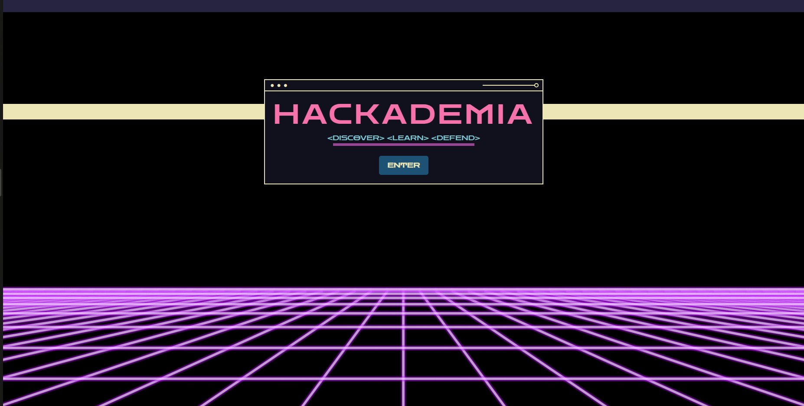
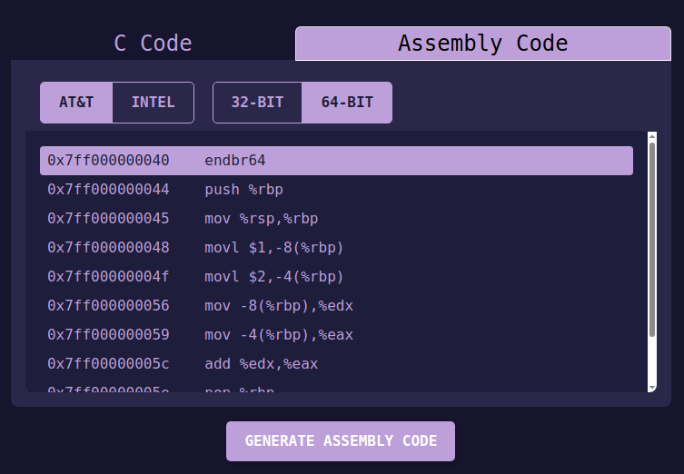
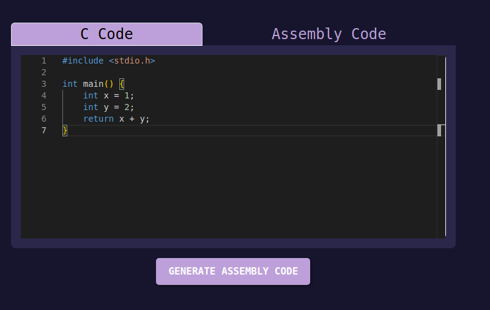
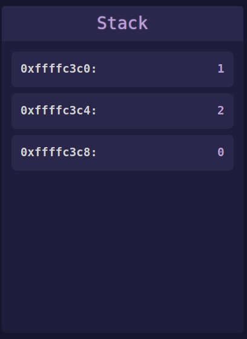
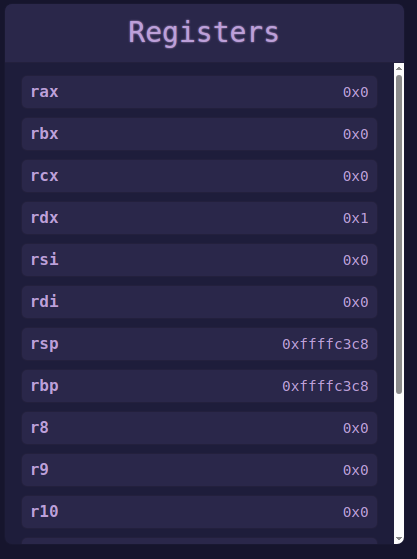
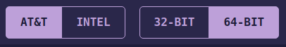
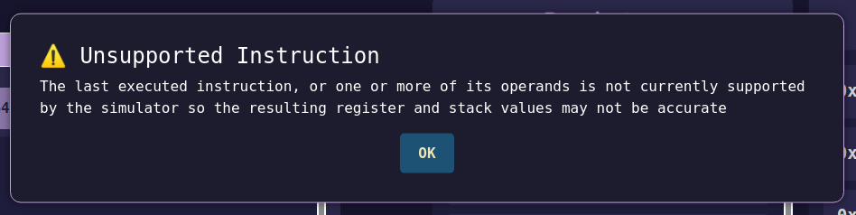

# Hackademia User Manual: Dynamic Call Stack Module
---

---

## 📚 Introduction

The **Dynamic Call Stack** module in Hackademia helps students visualize how function calls, local variables, and return addresses are managed in memory. It provides a real-time, animated simulation of the call stack as a C program executes, helping users better understand memory layout and function call mechanics.

---

## 🌐 Accessing the Module

To access the Dynamic Call Stack module:

1. Follow the server setup instructions provided in the project repository.
2. Once the local server is running, open your browser and navigate to the application.
3. On the landing page, click **"Enter"**.
4. From the main dashboard, select **"Dynamic Call Stack"** to begin using the module.

---

## 📆 Module Features

- C code editor with example programs.
- Persistent tabs for toggling between C source and assembly.
- Animated call stack that updates as the program executes.
- Bootstrap cards to represent individual stack frames.
- Line-by-line instruction execution with register and memory updates.
- Execution controls: **Step Forward**, **Step Backward**, **Reset**, and **Skip to End**.
- Warning pop-up when encountering unsupported assembly instructions.
- Supports both **32-bit and 64-bit** architectures.
- Compatible with both **Intel and AT&T** assembly syntax styles.

---

## 📄 Interface Overview

### **Code/Assembly Tabs**
The module features two persistent tabs that allow users to toggle between their original C source code and the corresponding assembly instructions. These tabs remain visible during execution, helping users contextualize stack behavior in either view.

 

---

### **Editor Panel**
This is where the active C or Assembly code is displayed. The currently executing line is highlighted, and updates as the user steps forward or backward through execution.

---

### **Stack Cards**
Function calls and their corresponding local variables are visualized using Bootstrap cards. Each card represents a stack frame and displays function metadata and scoped variables in real time.

---

### **Register Viewer**
A live view of CPU registers is displayed, showing how values change during execution. This helps students understand how variables are loaded, stored, and manipulated at the assembly level.

---

### **Execution Controls**
Users can interactively control how the program runs using four buttons:
- **Step Forward**
- **Step Backward**
- **Reset**
- **Skip to End**  
These controls allow precise navigation through the program's runtime behavior.

---

### **Mode Toggles**
The interface includes toggles for:
- **Architecture Mode**: Switch between 32-bit and 64-bit.
- **Assembly Syntax**: Choose between Intel and AT&T styles.  
Changing these will update the assembly view and internal representation accordingly.

---

## ❓ Frequently Asked Questions (FAQ)

**Q1: Can I input my own C code?**\
*A:* Yes. Basic C code is supported. Avoid using structs, complex pointers, or external libraries.

**Q2: Is the stack display accurate to real-world memory layout?**\
*A:* It is a high-level simulation meant for educational purposes. Real stack frames may contain additional system-level metadata.

**Q3: Can I pause/resume the animation?**\
*A:* You can control execution manually using the step forward/back, reset, or skip to end buttons.

**Q4: What happens if I encounter an unsupported instruction?**\
*A:* A pop-up warning will appear to notify you that the instruction is not currently supported. 

**Q5: Can I switch between assembly styles and architecture modes?**\
*A:* Yes, you can toggle between Intel and AT&T syntax, as well as between 32-bit and 64-bit modes.

---

## 👩‍💻 Developer Notes

- Built using **TypeScript**, **React**, and **Bootstrap**.
- Stack cards are dynamically generated with animation hooks.

---

